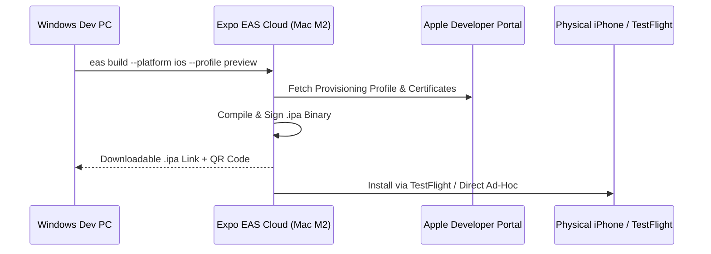

# Mr LAD - iOS Cloud Build & Deployment Guide (Windows)

This guide explains how to build, sign, and deploy **Mr LAD** for iOS directly from a **Windows development machine** without requiring a local Mac or Xcode.

---

## 🏗️ Build Architecture Overview



---

## 🚀 Quick Start: Building an iOS `.ipa` in 3 Steps

### Step 1: Initialize EAS Account (One-Time)
Run the setup script from Windows PowerShell:
```powershell
.\setup-eas.ps1
```
Or manually:
```bash
npm install -g eas-cli
eas login
```

### Step 2: Configure Apple Developer Credentials
Run:
```bash
eas credentials
```
- Select **iOS** -> **Production** (or **Preview**).
- Choose **"Let Expo handle all credentials"** (Recommended: EAS automatically creates and syncs certificates, distribution identifiers, and provisioning profiles via App Store Connect).

### Step 3: Trigger the Cloud Mac Build
Run the interactive script:
```powershell
.\build-ios.ps1
```
Or directly via npm scripts:
```bash
# Internal / Ad-Hoc Signed IPA (for testing directly on your iPhone):
npm run build:ios

# App Store / TestFlight Signed Release IPA:
npm run build:ios:prod

# iOS Simulator Build (un-signed .tar.gz):
npm run build:ios:sim
```

When the build finishes in the cloud (approx. 5–10 mins), EAS outputs:
1. A **direct download link** to the `.ipa` file.
2. A **QR code** you can scan with your iPhone camera to install the app immediately.

---

## 📱 How to Install the `.ipa` on Your iPhone from Windows

### Method A: TestFlight (Recommended for Team Testing & App Store)
1. Build with `npm run build:ios:prod`.
2. Submit directly:
   ```bash
   npm run submit:ios
   ```
3. Testers will immediately receive an email notification in the Apple **TestFlight** app.

### Method B: Direct Internal Ad-Hoc Installation (EAS QR Code)
1. Build with `npm run build:ios` (preview profile).
2. Register your iPhone's UDID with `eas device:create` (scan the QR code once on your phone).
3. Scan the build completion QR code to install the app over-the-air.

### Method C: Web Uploader (Diawi or InstallOnAir)
1. Download the `.ipa` file from the EAS build dashboard.
2. Upload the `.ipa` to [Diawi.com](https://www.diawi.com).
3. Open the Diawi link in Safari on your iPhone and tap **Install**.

---

## ⚙️ iOS Configuration Details

### App Identity
- **App Name**: `Mr LAD 2`
- **Bundle Identifier**: `com.company.mrlad`
- **Version**: `1.0.0`
- **Build Number**: `1.0.0` (auto-incremented by EAS)

### Permissions Configured (`Info.plist`)
| Permission | Usage Description |
|------------|-------------------|
| `NSCameraUsageDescription` | Allow Mr LAD to access your camera to take photos, scan business cards, and capture profile images. |
| `NSMicrophoneUsageDescription` | Allow Mr LAD to access your microphone to record voice notes and engage in AI assistant voice interactions. |
| `NSPhotoLibraryUsageDescription` | Allow Mr LAD to access your photo library to attach images and documents to CRM leads and chat messages. |
| `NSPhotoLibraryAddUsageDescription` | Allow Mr LAD to save exported spreadsheets, reports, and media directly to your photo library. |
| `NSLocationWhenInUseUsageDescription` | Allow Mr LAD to access your location to attach geo-tags to client meetings, fieldwork logs, and chat updates. |
| `NSFaceIDUsageDescription` | Allow Mr LAD to use Face ID for fast and secure biometric authentication. |
| `ITSAppUsesNonExemptEncryption` | Set to `false` (bypasses export compliance prompt). |

---

## 🛠️ Codemagic Alternative Pipeline

If your team uses **Codemagic**:
1. Connect your repository to Codemagic.
2. The included [`codemagic.yaml`](../codemagic.yaml) will automatically detect the project, provision Mac M2 build instances, install CocoaPods, build the IPA, and publish to TestFlight.
